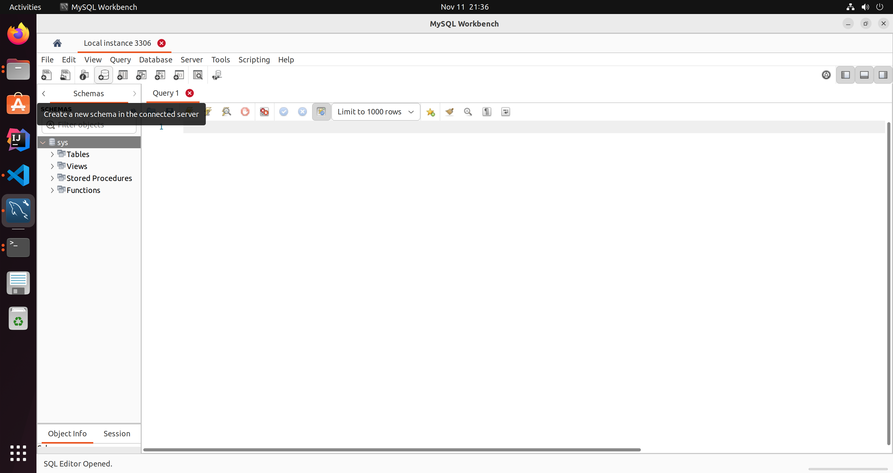

# Spring and MySQL local configuration tutorial

This tutorial is designed to help you get started with MySQL and your SpringBoot project. 
Authors: Jerry Nie, Tony Liu

## Table of Contents
1. [Prerequisite](#prerequisite)
2. [Steps based on different operating systems](#steps)
3. [Shared Steps](#sharedsteps)
4. [References](#references)


## 1. Prerequisite
   - IntelliJ IDEA
   - JDK 17 or higher [Please remember to use LTS version]
   - Reuqired OS: 
      - Ubuntu 20/22 [which should also work for ubuntu18 and MacOS]
      - Windows 10/11

## 2. Steps based on different operating systems
### 2.1 Ubuntu 20/22 [which should also work for ubuntu18 and MacOS]
   - Install MySQL
      - (1) run `sudo apt update`
      - (2) run `sudo apt install mysql-server`
         After the command is executed, run `sudo systemctl status mysql.service`to check the running status of the MySQL server. You should see something like this:
         ```
         ● mysql.service - MySQL Community Server
            Loaded: loaded (/lib/systemd/system/mysql.service; enabled; vendor preset: enabled)
            Active: active (running) since Sat 2023-11-11 20:18:20 MST; 1min 23s ago
           Process: 8807 ExecStartPre=/usr/share/mysql/mysql-systemd-start pre (code=exited, st>
          Main PID: 8815 (mysqld)
            Status: "Server is operational"
             Tasks: 37 (limit: 9387)
            Memory: 365.6M
               CPU: 1.819s
            CGroup: /system.slice/mysql.service
                    └─8815 /usr/sbin/mysqld
         ```
      - (3) run `sudo mysql_secure_installation`. This command is used to enhance the security of a MySQL server. 
      After the command is executed, the system will ask you do you want to setup VALIDATE PASSWORD component. You can choose `No` here. 
      Although we did not use VALIDATE PASSWORD component here, we still need to set a password for our root account. If the setting process
      does not show up, remeber to run `sudo mysql -u root` and then run `ALTER USER 'root'@'localhost' IDENTIFIED WITH mysql_native_password BY 'password';`.
      Remove anonymous users: chooes `Yes`. 
      Disallow root login remotely: chooes `Yes`. 
      Remove test database and access to it： `No`.
      Reload privilege tables now: `Yes`. 
   - Install MySQL Workbench: run `sudo snap install mysql-workbench-community`

### 2.2 Windows 10/11

   

## 3. Shared Steps
   - Create database
      - First open and connect to your local server
      - navigate to `Schemas`. Since we did not remove the test database, we should have a default database `sys` like this: 
        
      - Click the button in the picture and create the databse with the name you want. 
      - Remember, you do not need to create any table or insert any data into it, we are using JPA, JPA will create tables according to our code implementation.
   - **Remember, you don't need to do the next steps, I have already completed them for you.**
   - Connect to the database with your Spring project(you do not need to do these since I have done this for you, but I still believe it will be a good reference)
      - Add MySQL dependency: 
      Insert this to your `pom.xml`:
      ```xml
      <dependency>
         <groupId>mysql</groupId>
         <artifactId>mysql-connector-java</artifactId>
         <version>8.0.33</version> <!-- Change the version number according to actual situation -->
      </dependency>

      <dependency>
		   <groupId>org.springframework.boot</groupId>
		   <artifactId>spring-boot-starter-data-jpa</artifactId>
      </dependency>
      ```
      - Configure the database connection info
      Add this code into your `application.properties` or `application.yml`(in our project, we are using `application.properties`)
      ```
      spring.datasource.url=jdbc:mysql://localhost:3306/your_database_name
      spring.datasource.username=your_username
      spring.datasource.password=your_password

      # Hibernate properties
      spring.jpa.properties.hibernate.dialect=org.hibernate.dialect.MySQL5Dialect
      spring.jpa.hibernate.ddl-auto=update
      ```

      - Write a simple entity class
      In this step, I wrote a simple `Role` class as an example. 
      ```java
      @Entity
      @Table(name = "Roles")
      public class Role {
         @Id
         @GeneratedValue(strategy = GenerationType.AUTO)
         private int roleId;

         @Column(name="RoleName")
         private String roleName;

         public Role() {
         }

         public Role(int roleId, String roleName) {
            this.roleId = roleId;
            this.roleName = roleName;
         }

         public int getRoleID() {
            return roleId;
         }

         public void setRoleId(int roleId) {
            this.roleId = roleId;
         }

         public String getRoleName() {
            return roleName;
         }

         public void setRoleName(String roleName) {
            this.roleName = roleName;
         }
      }
      ```

      - Add Data Access Object(DAO) layer
      In this step, I wrote a simple `RoleRepository` class as an example. 
      ```java
      @Repository
      public interface RoleRepository extends CrudRepository<Role, Integer> {
         Role save(Role entity);

         void deleteRoleByRoleId(int id);

         Optional<Role> findByRoleId(int RoleID);

         Optional<Role> findByRoleName(String roleName);

         boolean existsById(int RoleID);
      }
      ```

      - Add Service layer
      In this step, I added a simple `RoleService` interface
      ```java
      public interface RoleService {
         Optional<Role> findRoleById(int roleId);

         Role addRole(Role role);

         void deleteRole(int roleId);
      }
      ```
      and implemented it by `RoleServiceImpl` class as an example. 
      ```java
      @Service
      public class RoleServiceImpl implements RoleService {

         @Autowired
         private RoleRepository roleRepository;

         @Override
         public Optional<Role> findRoleById(int roleId) {
            return roleRepository.findByRoleId(roleId);
         }

         @Override
         public Role addRole(Role role) {
            return roleRepository.save(role);
         }

         @Override
         public void deleteRole(int roleId) {
            roleRepository.deleteRoleByRoleId(roleId);
         }
      }
      ```

   - In the end, all you need to do run the `Application.java` and check in the database whether the roles table was successfully created and whether it contains the piece of data you inserted.
   ```java
   @SpringBootApplication
   public class Application {

      public static void main(String[] args) {
         SpringApplication.run(Application.class, args);
      }

      @Bean
      CommandLineRunner runner(RoleRepository repository) {
         return args -> {

            Role role = new Role();
            role.setRoleName("TestRole");

            repository.save(role);
            Optional<Role> saved = repository.findByRoleId(role.getRoleID());
         };
      }
   }
   ```

## 4. References: 
   - install MySQL and MySQL workbench: https://www.youtube.com/watch?v=zRfI79BHf3k
   - setup pw after installation: https://stackoverflow.com/questions/7864276/cannot-connect-to-database-server-mysql-workbench
   - Create database with MySQL workbench: https://www.youtube.com/watch?v=wALCw0F8e9M
   - Accessing data with MySQL: https://spring.io/guides/gs/accessing-data-mysql/


